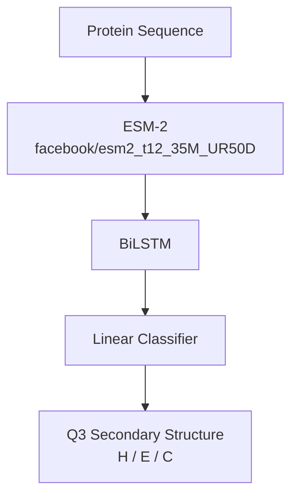

# Protein Secondary Structure Prediction

A deep learning project for predicting protein secondary structure using **ESM-2** protein language model embeddings and a **BiLSTM** classifier.

## Overview

Protein secondary structure prediction assigns each amino acid to one of three structural classes:

- **H** — Alpha helix
- **E** — Beta strand
- **C** — Coil

This project uses the pretrained **ESM-2 (`facebook/esm2_t12_35M_UR50D`)** model to obtain contextual protein representations, followed by a BiLSTM-based sequence classifier for Q3 secondary structure prediction.

## Model Architecture


The model uses the pretrained ESM-2 architecture with the final 3 ESM layers unfrozen during training, followed by a BiLSTM sequence classifier.
ESM-2 provides contextual representations for each amino acid, while the BiLSTM captures sequential dependencies along the protein sequence.

## Dataset

The project uses the **NetSurfP-2.0** dataset:

- Training: Train_HHblits
- Validation: CB513
- Test: TS115

The dataset provides protein sequences and secondary-structure labels. The model uses the protein sequences as input to ESM-2.

## Evaluation

The trained model was evaluated on the independent CB513 and TS115 benchmark datasets.

### Results

| Dataset | Q3 Accuracy | Q3 Macro F1 |
|---|---:|---:|
| CB513 | **81.17%** | **80.72%** |
| TS115 | **82.63%** | **81.95%** |

The evaluation also includes Q8 metrics, which are reported in `evaluation.ipynb`.

## Project Structure

```text
protein-secondary-structure-prediction/
├── training.ipynb
├── evaluation.ipynb
├── README.md
├── requirements.txt
├── .gitignore
└── LICENSE
```

## Notebooks

- [`training.ipynb`](training.ipynb) — preprocessing, ESM-2 + BiLSTM model training, and checkpointing.
- [`evaluation.ipynb`](evaluation.ipynb) — evaluation on the CB513 and TS115 benchmark datasets.

## Technologies

- Python
- PyTorch
- Hugging Face Transformers
- ESM-2
- BiLSTM
- NumPy
- scikit-learn
- tqdm
- Kaggle GPU

## License

This project is licensed under the MIT License.
